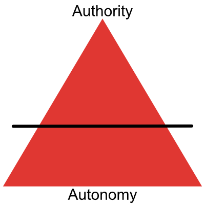
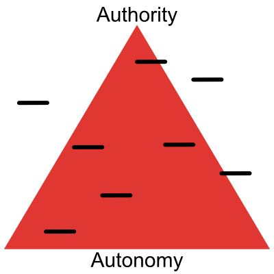
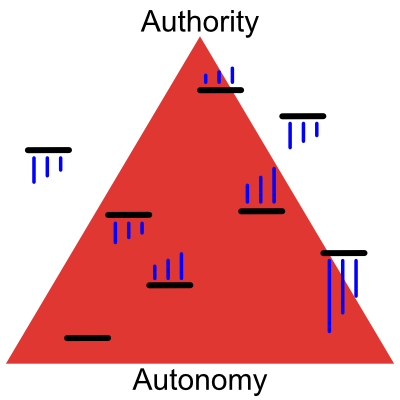

# Dynamic Command and Control
In a recent [presentation](https://medium.com/r/?url=https%3A%2F%2Fwww.infoq.com%2Fpresentations%2F3-laws-business-agility), Steve Denning uses the visual of a pyramid to represent the level of command and control within an organization. He correctly asserts that Agile organizations still operate under the principles of command and control, but with the goal of moving decision making into semi-autonomous teams as much as possible. The aspiration is to follow the Goldilocks rule — not too little, not too much → just right. This is called Mission Command and is central to military doctrine. We’ll discuss more about that later.

While this model is a good start, it doesn’t sufficiently capture the nuances of reality. There are many dimensions to this model. Some dimensions are very controlled, and other dimensions are very loose.

Think of this as the mixer in a sound system. The right combination is what creates beautiful music within the organization.

__ Photo by Alexey Ruban on Unsplash __
But there’s still one missing piece. We don’t exist in static environments. Our world is constantly changing. It’s like recording a song in a studio versus performing it live in a concert venue. One environment is tightly controlled, whereas the other is unpredictable and dynamic. We live and work in a “live environment.” This means that the sliders have to move in response to our environment. Some only need fine tuning, whereas others require major adjustments. To extend the analogy, most organizations act like a sound crew that expects the settings from the recording studio to translate verbatim to the live stage, and then they get upset when the music doesn’t sound right.

In a smaller organization, we can stop here. The scope of leadership’s influence extends far enough to be able to exert their authority across the whole organization. In a larger company, this picture still isn’t sufficient. Instead, it looks like this (or worse), with little alignment in direction from the many sources of organizational authority.

Every organization within the larger organization is attempting to fine-tune the balance of authority vs. autonomy within their scope of control, while also attempting to adjust for changes being made by others. We shouldn’t criticize the leaders who are making these changes. Within their context, the adjustments are necessary and legitimate, and the problem of attaining alignment across boundaries is real and challenging. The changes in policy represented above are usually legitimate responses to changes in the outside world or internal organizational context. Unfortunately, the teams receiving these changes experience constant whiplash and cross-talk between the many sources of organizational authority such as their direct management, project management, finance, legal, human resources, and IT.
Next time, I’ll write about how large cutting edge organizations are handling the challenge of dynamic command and control. You may be surprised.
